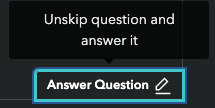

# State of React Native 2023

This is a questions list proposal for the 2023 edition of the State of React Native survey.

- [State of React Native 2023](#state-of-react-native-2023)
- [Overall suggestions](#overall-suggestions)
  - [Must do](#must-do)
  - [Won't do](#wont-do)
- [Survey 2023 questions](#survey-2023-questions)
  - [Developer background](#developer-background)
    - [Before React Native](#before-react-native)
    - [How do you use React Native?](#how-do-you-use-react-native)
    - [Desktop OS](#desktop-os)
    - [Top React Native app user count](#top-react-native-app-user-count)
    - [Team size](#team-size)
    - [Target platforms](#target-platforms)
    - [Contribution to React Native](#contribution-to-react-native)
    - [Contribution to React Native libraries](#contribution-to-react-native-libraries)
    - [Number of released apps](#number-of-released-apps)
    - [What mobile OS versions do you target?](#what-mobile-os-versions-do-you-target)
    - [Industry sector](#industry-sector)
  - [Platform APIs](#platform-apis)
    - [Platform APIs usage](#platform-apis-usage)
  - [State management](#state-management)
    - [Overall happiness](#overall-happiness)
  - [Data fetching](#data-fetching)
    - [Overall happiness](#overall-happiness-1)
  - [Navigation](#navigation)
    - [Overall happiness](#overall-happiness-2)
  - [Styling](#styling)
    - [Overall happiness](#overall-happiness-3)
  - [UI Components libraries](#ui-components-libraries)
    - [Overall happiness](#overall-happiness-4)
  - [Graphics and animations](#graphics-and-animations)
    - [Overall happiness](#overall-happiness-5)
  - [Other app aspects](#other-app-aspects)
    - [Storage](#storage)
    - [Data visualisation](#data-visualisation)
    - [Interactions](#interactions)
    - [Internationalization](#internationalization)
    - [Analytics](#analytics)
    - [Crash reporting](#crash-reporting)
    - [Testing](#testing)
  - [React Native features](#react-native-features)
    - [React Native version](#react-native-version)
    - [Debugging tools](#debugging-tools)
    - [Performance profiling](#performance-profiling)
    - [Do you integrate React Native with applications written using other technology?](#do-you-integrate-react-native-with-applications-written-using-other-technology)
    - [OTA updates solutions](#ota-updates-solutions)
    - [Code sharing](#code-sharing)
  - [Deployment](#deployment)
  - [Tools](#tools)
    - [JavaScript/TypeScript Balance](#javascripttypescript-balance)
    - [Package Mangers](#package-mangers)
    - [Starter templates](#starter-templates)
  - [Monorepo tools](#monorepo-tools)
  - [React Native alternatives](#react-native-alternatives)
  - [Resources](#resources)
    - [Learning methods](#learning-methods)
    - [Blogs \& magizines](#blogs--magizines)
    - [Sites \& courses](#sites--courses)
    - [Podcasts](#podcasts)
    - [Video creators](#video-creators)
    - [People](#people)
    - [Online communities](#online-communities)
    - [Other surveys](#other-surveys)
  - [Opinions](#opinions)
    - [React Native is moving in the right direction](#react-native-is-moving-in-the-right-direction)
    - [Building React Native apps is overly complex right now](#building-react-native-apps-is-overly-complex-right-now)
    - [The React Native ecosystem is changing too fast](#the-react-native-ecosystem-is-changing-too-fast)
    - [React Native pain points](#react-native-pain-points)
    - [Missing features](#missing-features)
    - [React Native advantages](#react-native-advantages)
    - [How happy are you with the general state of React Native?](#how-happy-are-you-with-the-general-state-of-react-native)
  - [About you](#about-you)
    - [Your country or region](#your-country-or-region)
    - [Your age](#your-age)
    - [Years of experience](#years-of-experience)
    - [Years of experience in React Native](#years-of-experience-in-react-native)
    - [Company size](#company-size)
    - [Higher education degree](#higher-education-degree)
    - [Yearly salary](#yearly-salary)
    - [Your gender](#your-gender)
    - [How did you find out about this survey?](#how-did-you-find-out-about-this-survey)
    - [How could we improve this survey?](#how-could-we-improve-this-survey)


# Overall suggestions

## Must do

- reorder responses:
  ```diff
  - 🤷 Never heard of it/Not sure what it is
  - ✅ Heard of it > Would like to learn
  - 🚫 Heard of it > Not interested
  - 👍 Used it > Would use again
  - 👎 Used it > Would not use again
  + 👍 Used it > Would use again
  + 👎 Used it > Would not use again
  + ✅ Heard of it > Would like to learn
  + 🚫 Heard of it > Not interested
  + 🤷 Never heard of it/Not sure what it is
  ```
- add creators to the technologies/libraries to minimize confusion (e.g. `react-native-gesture-handler (by Software Mansion)`)
- unify the names of the libraries (Upper Case, lower case, `package-names`)


## Won't do

- add some links to the subjects and libraries mentioned in the options
  - State of JS has this `add to learning list` action that could be consumed once the survey is completed

  | CTA | Preview | Result |
  |:-:|:-:|:-:|
  |  |  |  |
- add possibility to max out the survey (100%) by `skipping` a question

  | Skip | Unskip |
  |:-:|:-:|
  |  |  |
- add progress bar
- development environment questions (like IDE, extensions/plugins, etc)
- better questions responses

  | Two step response |
  |:-:|
  | 


# Survey 2023 questions


---


## [Developer background](https://survey.stateofreactnative.com/en/survey/state-of-react-native/2022/read-only/1)
What's your background as a developer?

### Before React Native
What was your background before you started using React Native? Check all that apply
**(*multiselect checkbox*)**
- React developer
- iOS developer
- Android developer
- Frontend developer (other than React e.g. Vue, Angular, SolidJS, Svelte, etc.)
- Backend developer (PHP, Node.js, JVM, Python, etc.)
- Desktop developer (e.g. macOS, Windows, Linux)
- QA engineer
- DevOps
- Embedded developer
- Non-technical role
- Started with React Native
- Other background
  > Other answers (freeform)

### How do you use React Native?
**(*radio buttons*)**
- Professionally
- As a student
- As a hobby

### Desktop OS
What desktop OS do you primarily use?
**(*radio buttons*)**
- macOS
- Linux
- Windows

### Top React Native app user count
What is the user count of your top React Native app?
**(*radio buttons*)**
- Only me
- 2-100
- 101-1k
- 1k-10k
- 10k-100k
- 100k-1M
- 1M and more

### Team size
What is your mobile app team size?
**(*radio buttons*)**
- Solo developer
- 2
- 3-5
- 6-10
- more than 10

### Target platforms
What are the platforms that you use React Native for? Check all that apply
**(*multiselect checkbox*)**
- iOS
- Android
- Web
- macOS
- Windows
- Android TV
- tvOS
- Other target platforms
  > Other answers (freeform)

### Contribution to React Native
Have you contributed to React Native in 2022?
**(*radio buttons*)**
- Yes
- No

### Contribution to React Native libraries
Have you contributed to any React Native community library in 2022?
**(*radio buttons*)**
- Yes
- No

### Number of released apps
How many React Native apps have you released on Google Play or App Store?
**(*radio buttons*)**
- None
- 1
- 2-5
- 5-10
- More than 10

### What mobile OS versions do you target?
**(*radio buttons*)**
```diff
- Most recent ones (iOS 16+, Android 13+)
+ Most recent ones (iOS 17+, Android 14+)
```
- Reasonably current (iOS 12+, Android 10+)
- Old (iOS 10+, Android 7+)
- As old as possible (iOS 8+, Android 5+)

### Industry sector
Which industry sector(s) are you using React Native in? Check all that apply.
**(*multiselect checkbox*)**
- Ecommerce & Retail
- News, Media, & Blogging
- Healthcare
- Finance
- Crypto & Web3
- Programming & Technical Tools
- Social Media
- Marketing/Sales/Analytics Tools
- Education
- Real Estate
- Government
- Entertainment
- Consulting & Services
- Travel
- Insurance
- Logistics
- Telecommunications
- Student
- Hospitality
- Cyber Security
- Construction
- Automotive
- Agriculture
- Transport
- Manufacturing
- Other industry sectors
  > Other answers (freeform)


---


## [Platform APIs](https://survey.stateofreactnative.com/en/survey/state-of-react-native/2022/read-only/2)
The features provided by the operation system.

### Platform APIs usage
What Platform APIs have you used in 2022 in React Native? Check all that apply
**(*multiselect checkbox*)**
- Sensors (gyroscope, accelerometer, etc.)
- Camera
- Audio playback
- Appearance
- Accessibility
- Microphone
- Media library (gallery)
- File System
- Haptics
- Video playback
- Clipboard
- OpenGL
- Telephony (SMS, email, dialing, etc.)
- Location
- Maps
- Screen orientation
- Battery
- Bluetooth
- NFC
- RTL
- Biometric authentication
- Cryptography (e.g. hardware encryption)
- Notifications
- In-app payments
- In-app reviews
- WebView
- Persistent storage (e.g. SQL database)
- Deep links
- Background processing
- Printer
- OCR
- AR / VR
- ML / AI
- Permissions
```diff
+ new APIs that were introduced throughout the last year or gained some more momentum on mobiles
# https://developer.apple.com/documentation/ios-ipados-release-notes
# https://developer.android.com/about/versions/13/summary
# https://developer.android.com/about/versions/13/features
# https://developer.android.com/about/versions/14/summary
# https://developer.android.com/about/versions/14/features
```
- Other platform APIs usage
  > Other answers (freeform)


---


## [State management](https://survey.stateofreactnative.com/en/survey/state-of-react-native/2022/read-only/3)
What state management solutions do you regularly use in your React Native apps?

🤷 / ✅ / 🚫 / 👍 / 👎
**(*radio buttons*)**
- React (useState, useReducer, useContext, this.state)
- Jotai
- Zustand
- Redux
- Recoil
- Apollo Client
- TanStack QUery (React Query)
```diff
- Legend State
- React Easy State
```
```diff
+ MobX
+ XState
+ Redux Toolkit
```
- Other state management
  > Other answers (freeform)

### Overall happiness
How do you feel about the current overall state of state management solutions available for React Native?
**(*radio buttons*)**
- Very Unhappy / Unhappy / Neutral / Happy / Very Happy


---


## [Data fetching](https://survey.stateofreactnative.com/en/survey/state-of-react-native/2022/read-only/4)
What data fetching solutions do you regularly use in your React Native apps?

🤷 / ✅ / 🚫 / 👍 / 👎
**(*radio buttons*)**
- Fetch API
- Axios
- Apollo Client
- tRPC
- TanStack QUery (React Query)
- SWR
- Relay
```diff
+ RTK QUery
```
- Other data fetching
  > Other answers (freeform)

### Overall happiness
How do you feel about the current overall state of data fetching solutions available for React Native?
**(*radio buttons*)**
- Very Unhappy / Unhappy / Neutral / Happy / Very Happy


---


## [Navigation](https://survey.stateofreactnative.com/en/survey/state-of-react-native/2022/read-only/5)
What navigation solutions do you regularly use in your React Native apps?

🤷 / ✅ / 🚫 / 👍 / 👎
**(*radio buttons*)**
- react-navigation
- react-native-navigation
- react-router
- expo-router
- navigation-react-native
- other navigation solutions
  > Other answers (freeform)

### Overall happiness
How do you feel about the current overall state of navigation solutions available for React Native?
**(*radio buttons*)**
- Very Unhappy / Unhappy / Neutral / Happy / Very Happy


---


## [Styling](https://survey.stateofreactnative.com/en/survey/state-of-react-native/2022/read-only/6)
What styling techniques do you regularly use in your React Native apps?

🤷 / ✅ / 🚫 / 👍 / 👎
**(*radio buttons*)**
- StyleSheet API
- NativeWind
- tailwind-rn
- styled components
- Tamagui
- Restyle
- Inline styling
```diff
# moved from UI Components libraries
+ Dripsy
```
```diff
# taken from https://github.com/efstathiosntonas/react-native-style-libraries-benchmark
+ react-native-unistyles (https://github.com/jpudysz/react-native-unistyles)
+ @emotion/native (https://emotion.sh/docs/@emotion/native)
+ react-native-zephyr (https://github.com/FormidableLabs/react-native-zephyr)
+ @gluestack-style/react (https://github.com/gluestack/gluestack-style)
+ @fast-styles/react (https://github.com/fedemartinm/fast-styles)
+ twrnc (https://github.com/jaredh159/tailwind-react-native-classnames)
```
- other styling techniques
  > Other answers (freeform)

### Overall happiness
How do you feel about the current overall state of styling techniques available for React Native?
**(*radio buttons*)**
- Very Unhappy / Unhappy / Neutral / Happy / Very Happy


---


## [UI Components libraries](https://survey.stateofreactnative.com/en/survey/state-of-react-native/2022/read-only/7)
What UI components libraries do you regularly use in your React Native apps?

🤷 / ✅ / 🚫 / 👍 / 👎
**(*radio buttons*)**
- react-native-paper
- ui-kitten
- React Native Elements
- react-native-material-ui
- NativeBase
- react-native-ui-lib
```diff
# moved to Styling
- Dripsy
```
- Shoutem UI
```diff
+ @gluestack-ui/themed (https://github.com/gluestack/gluestack-ui)
+ Tamagui
```
- Other UI components libraries
  > Other answers (freeform)

### Overall happiness
How do you feel about the current overall state of UI components libraries available for React Native?
**(*radio buttons*)**
- Very Unhappy / Unhappy / Neutral / Happy / Very Happy


---


## [Graphics and animations](https://survey.stateofreactnative.com/en/survey/state-of-react-native/2022/read-only/8)
What graphics and animations solutions do you use in your React Native apps?

🤷 / ✅ / 🚫 / 👍 / 👎
**(*radio buttons*)**
- Animated API
- React Native Reanimated
- Moti
- React Native Skia
- React Native Animatable
- Three.js
- React Three Fiber
- Lottie
- Expo GL
- Legend Motion
```diff
+ Rive
```
- Other graphics and animations solutions
  > Other answers (freeform)

### Overall happiness
How do you feel about the current overall state of graphics and animations solutions available for React Native?
**(*radio buttons*)**
- Very Unhappy / Unhappy / Neutral / Happy / Very Happy


---


## [Other app aspects](https://survey.stateofreactnative.com/en/survey/state-of-react-native/2022/read-only/9)
What solutions to other well-defined problems do you regularly use in your React Native apps?

### Storage
Check all that apply
**(*multiselect checkbox*)**
- React Native Async Storage
- Realm
- WatermelonDB
- react-native-mmkv
- react-native-mmkv-storage
- React Native SQLite Storage
- Expo SQLite
- RxDB
- Other storage solutions
  > Other answers (freeform)

### Data visualisation
Check all that apply
**(*multiselect checkbox*)**
- Victory Native
- react-native-svg
- Recharts
- React Native Charts Kit
- React Native Charts Wrapper
- Other data visualisation solutions
  > Other answers (freeform)

### Interactions
Check all that apply
**(*multiselect checkbox*)**
- PanResponder API
- Touchables/Pressables
- React Native Gesture Handler
- Other interactions solutions
  > Other answers (freeform)

### Internationalization
Check all that apply
**(*multiselect checkbox*)**
- react-native-localize
- react-i18next
- FBT
- other internationalization solutions
  > Other answers (freeform)

### Analytics
Check all that apply
**(*multiselect checkbox*)**
- Firebase Analytics
- AppCenter Analytics
- Amplitude
- Amplify Analytics
- Mixpanel
- Segment
- AppsFlyer
- Flurry
- Other analytics solutions
  > Other answers (freeform)

### Crash reporting
Check all that apply
**(*multiselect checkbox*)**
- Sentry
- Datadog
- Instabug
- New Relic
- AppDynamics
- Amazon CloudWatch
- Elastic Observability
- Bugsnag
- Firebase Crashlytics
- AppCenter Crashes
- Other crash reporting solutions
  > Other answers (freeform)

### Testing
Check all that apply
**(*multiselect checkbox*)**
- Jest
- React Native Testing Library
- Detox
- Appium
- Maestro
- XCUITest
- Espresso
```diff
+ Storybook
```
- Other testing solutions
  > Other answers (freeform)


---


## [React Native features](https://survey.stateofreactnative.com/en/survey/state-of-react-native/2022/read-only/10)
What is your knowledge of the features specific to React Native development?

### React Native version
Which version do you use mainly?
**(*radio buttons*)**
```diff
+ 0.72
```
- 0.71
- 0.70
- 0.69
- 0.68
- 0.67
- 0.66
- 0.65
- 0.64
- 0.63 or lower

🤷 / ✅ / 🚫 / 👍 / 👎
**(*radio buttons*)**
- New Architecture
- Fabric
- Codegen
- Custom native modules
- Turbo Native Modules
- Expo Modules
- Custom native views
- JSC runtime
- Hermes runtime
- V8 runtime
- JSI
```diff
Moved from Learning methods
+ React Native Directory
```

### Debugging tools
What tools do you use to debug your React Native apps? Check all that apply
**(*multiselect checkbox*)**
- React Native Debugger
- Chrome DevTools
- React Developer Tools
- Native debugging (Xcode, Android Studio)
- Reactotron
- Flipper
- Console logs
- Other debugging tools
  > Other answers (freeform)

### Performance profiling
What tools do you use to profile React Native app performance? Check all that apply
**(*multiselect checkbox*)**
- Native profiling (Xcode, Android Studio)
- React Native Performance
- React Native Performance Monitor
- Flipper
- React Native Flipper Performance Plugin
- Other performance profiling tools
  > Other answers (freeform)

### Do you integrate React Native with applications written using other technology?
**(*radio buttons*)**
- I mainly work on standalone React Native apps (greenfield)
- I mainly work on integrated React Native apps (brownfield)
- I work on both standalone and brownfield apps

### OTA updates solutions
What Over-The-Air updates solutions do you use? Check all that apply
**(*multiselect checkbox*)**
- CodePush
- EAS Update
- Expo Classic Updates
- Self-hosted
- Other OTA updates solutions
  > Other answers (freeform)

### Code sharing
What methods do you employ for sharing code between mobile and web platforms in your project, if any? Check all that apply
**(*multiselect checkbox*)**
- React Native Web
- Solito
- React Native WebView running mobile version of a website
- Common business logic, independent UI components
- Independent projects
- Other code sharing
  > Other answers (freeform)


---


## [Deployment](https://survey.stateofreactnative.com/en/survey/state-of-react-native/2022/read-only/11)
How do you build and submit your app for the App Store or Google Play?

🤷 / ✅ / 🚫 / 👍 / 👎
**(*radio buttons*)**
- Manually with Xcode
- Manually with Android Studio
- Fastlane
- EAS Build
- EAS Submit
- App Center
- Other ways to build app and submit for the App Store or Google Play
  > Other answers (freeform)


---


## [Tools](https://survey.stateofreactnative.com/en/survey/state-of-react-native/2022/read-only/12)
The tools you use to develop React Native apps.

### JavaScript/TypeScript Balance
How do you divide your time between writing JavaScript and TypeScript code?
**(*radio buttons*)**
- 100% JavaScript / 50%-50% / 100% TypeScript

### Package Mangers
**(*radio buttons*)**
- npm
- yarn
- yarn berry (yarn v2+)
- pnpm

### Starter templates
**(*multiselect checkbox*)**
- create-expo-app
- react-native init
- ignite-cli
- create-t3-turbo
```diff
+ create-react-native-app
```
- Other starter templates
  > Other answers (freeform)

🤷 / ✅ / 🚫 / 👍 / 👎
**(*radio buttons*)**
- rnx-kit
- Expo Snack
- Expo CLI
- EAS CLI
- React Native CLI
- Ignite CLI
- Other development tools
  > Other answers (freeform)


---


## [Monorepo tools](https://survey.stateofreactnative.com/en/survey/state-of-react-native/2022/read-only/13)
What monorepo tools have you used?

🤷 / ✅ / 🚫 / 👍 / 👎
**(*radio buttons*)**
- yarn workspaces
- npm workspaces
- Turborepo
- Lerna
- pnpm
- Nx
```diff
- Rush
```
- Other monorepo tools
  > Other answers (freeform)


---


## [React Native alternatives](https://survey.stateofreactnative.com/en/survey/state-of-react-native/2022/read-only/14)
What other cross-platform app development solutions are you familiar with?

🤷 / ✅ / 🚫 / 👍 / 👎
**(*radio buttons*)**
- Flutter
- Xamarin
- Cordova
- Ionic
- SwiftUI
- Jetpack Compose
- NativeScript
- Kotlin Multiplatform Mobile
```diff
- Felgo
```
```diff
+ Other React Native alternatives
+ > Other answers (freeform)
```


---


## [Resources](https://survey.stateofreactnative.com/en/survey/state-of-react-native/2022/read-only/15)
What React Native resources do you consult?

### Learning methods
What methods do you use to learn and improve your React Native skills? Check all that apply
**(*multiselect checkbox*)**
- Official React Native docs
- Expo docs
- Books
- Videos
- Online courses (free)
- Online courses (paid)
- School / higher education
- Podcasts
- Coding bootcamp
```diff
moved to React Native Features
- React Native Directory
```
- On-the-job training
- Mentoring
- Self-directed learning
- Other learning methods
  > Other answers (freeform)

### Blogs & magizines
What blogs/magazines/etc. do you read? Write all that apply (freeform)

### Sites & courses
What sites/courses/etc. do you consult? Write all that apply (freeform)

### Podcasts
What programming-related podcasts do you listen to? Write all that apply (freeform)

### Video creators
Video creators you follow on video-centric platforms such as YouTube, Twitch, TikTok, etc. Write all that apply (freeform)

### People
People you read, follow, or just want to highlight for their work. Write all that apply (freeform)

### Online communities
Online communities you actively participate in, such as Slack workspaces, Discord servers, Reddit topics, etc.. Write all that apply (freeform)

### Other surveys
What other developer surveys do you participate in? Check all that apply
**(*multiselect checkbox*)**
- State of JS
- State of CSS
- State of GraphQL
- JetBrains State of Developer Ecosystem
- Stack Overflow Annual Developer Survey
- CodinGame Developer Survey
- Design Tools Survey
- Postman State of the API Report
- Jamstack Community Survey
- Other surveys not mentioned above
  > Other answers (freeform)


---


## [Opinions](https://survey.stateofreactnative.com/en/survey/state-of-react-native/2022/read-only/16)
How do you feel about the state of React Native?

### React Native is moving in the right direction
**(*radio buttons*)**
- Disagree strongly / Disagree / Neutral / Agree / Agree strongly

### Building React Native apps is overly complex right now
**(*radio buttons*)**
- Disagree strongly / Disagree / Neutral / Agree / Agree strongly

### The React Native ecosystem is changing too fast
**(*radio buttons*)**
- Disagree strongly / Disagree / Neutral / Agree / Agree strongly

### React Native pain points
Write anything that makes you feel annoyed while developing React Native apps (freeform)
```diff
+ upgrades
+ debugging
+ performance
+ unmaintained packages
+ reliance of 3rd party modules
+ new architecture
+ building
+ documentation
+ native modules
+ styling
+ platform inconsistencies
+ navigation solutions
+ errors
+ keyboard
+ setup
+ stability
+ graphics and animations
+ deployment
```

### Missing features
What do you feel currently is missing from React Native? Write all that apply (freeform)
```diff
+ CSS features
+ better debugging/better profiling
+ first-party libraries
+ better integration (compatibility?)
+ better performance
+ multithreading
+ better animations/gestures
+ out-of-the-box storage
+ better documentation
+ out-of-the-box audio/video
+ better testing
+ better FlatList
+ Android shadows
+ better keyboard handling
+ out-of-the-box filesystem
+ out-of-the-box SVG
+ SwiftUI/Jetpack Compose integration
```
```diff
+ out-of-the-box Camera
```

### React Native advantages
What are advantages of React Native over other solutions? Write all that apply (freeform)
```diff
+ Web technologies
+ Cross-platform
+ Developer experience
+ Easy to learn
+ Single codebase
+ Ecosystem
+ Community
+ Native ?
+ Performance
+ Code sharing
+ Over-the-air updates
+ Expo
+ Fast iterations
+ Time to market
+ Cost-effective
+ Hot reloading
+ Stable
+ Documentation
```

### How happy are you with the general state of React Native?
**(*radio buttons*)**
- Very Unhappy / Unhappy / Neutral / Happy / Very Happy


---


## [About you](https://survey.stateofreactnative.com/en/survey/state-of-react-native/2022/read-only/17)
Let's get to know you a little better.

### Your country or region
Where do you currently reside?
- Select option

### Your age
How old are you, in years?
**(*radio buttons*)**
- 18 or younger
- 19-24
- 25-34
- 35-44
- 45-54
- 55-64
- 65 or older

### Years of experience
How long have you been working as a programmer or studying programming?
**(*radio buttons*)**
- 1 year or less
- 2 to 3 years
- 4 to 5 years
- 6 to 10 years
- 11 to 20 years
- More than 20 years

### Years of experience in React Native
How long have you been working with or studying React Native, in years?
**(*radio buttons*)**
- 1 year or less
- 2 to 3 years
- 4 to 5 years
- 6 years or more

### Company size
How big is your company, in the number of employees?
**(*radio buttons*)**
- 1 employee
- 2 to 5 employees
- 6 to 10 employees
- 11 to 20 employees
- 21 to 50 employees
- 51 to 100 employees
- 101 to 500 employees
- 501 to 1000 employees
- more than 1000

### Higher education degree
Do you have a higher education degree?
**(*radio buttons*)**
- No
- Yes, related to my profession
- Yes, unrelated to my profession

### Yearly salary
Your yearly salary in U.S. dollars.
**(*radio buttons*)**
- I work for free
- $0k-10k
- $10k-30k
- $30k-50k
- $50k-100k
- $100k-200k
- more than $200k

### Your gender
Which of the following options describes you, if any?
**(*radio buttons*)**
- Female
- Male
- Non-Binary or Gender Non-Conforming
- Not listed
> While we know collecting and publishing diversity data can be a sensitive issue, we do think it's important to obtain this data to help measure and improve the survey's efforts in terms of inclusivity and representativeness.

### How did you find out about this survey?
- freeform

### How could we improve this survey?
- freeform
